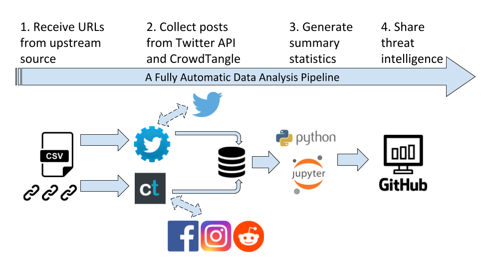

### How does Misinformation Tracer work?

__NOTE: We are currently working on collecting and analyzing COVID-19 related URLs.__

Misinformation Tracer is a fully automated data collection and data processing pipeline. It takes a list of URLs as input, and automatically collects posts/tweets containing those URLs from four social media platforms. After the data collection, a python script loads the data, calculates summary statistics, and generates a Jupyter Notebook in HTML format, which is published on this website.

### What do we analyze?

Our analysis focuses on four social media platforms (**Twitter, Facebook, Instagram, Reddit**). Currently the results include:

* post volume (total, average per URL, per user)
* user volume (total, average per URL)
* timeline posting pattern
* longivity of a URL 
* heavy user characterization (name, description)

### Current data collections

| Dataset      | Source    |   Date Last Collected    | Status            | Result |
|:-------------|:------------------|:------------------|:------------------|:-------|
| CSMaP 150 URLs  |  Please contact us  | March 22, 2020| Finished       | [link](./csmap_150_url.html){:target="_blank"}  |
| Coronavirus URLs|  Please contact us  | March 22, 2020| Finished       | [link](./coronavirus.html){:target="_blank"}   |
| Coronavirus 3/22-3/29|Please contact us | March 29, 2020| Finished     |[link](./tracker_200329.html){:target="_blank"}   |
| Coronavirus 3/30-4/5 |Please contact us | April 05, 2020| Finished     |[link](./tracker_200405.html){:target="_blank"}   |

<!-- [link](./source/mit_collection.csv) -->
<!-- [link](./source/csmap_150.csv) -->
<!-- [link](./source/coronavirus.csv) -->

### What type of data are we able to collect?

We caution that account status is highly dynamic. One account can become public, private, suspended, or deleted in a short amount of time. Therefore our collection is _best effort_, meaning we collect as much as we can at the moment we collect. There is no guarantee that rerunning the pipeline on the same dataset gives the same results. However, we don't expect a significant difference given a large sample size. 

Here is a list of posts we collect from each platform:

1. Facebook: posts from public accounts.
2. Instagram: posts from public accounts.
3. Twitter: any searchable tweets from public accounts. We also collect all retweets of original tweets, and aggregate results.  
4. Reddit: any searchable post that embeds the input URL.
5. Facebook interaction: aggregated counts from both public and private accounts.

* * *

### Contact

Site creator: Zhouhan Chen, NYU Center for Data Science, <zc1245@nyu.edu>

Collaborator: Kevin Aslett, NYU Center for Social Media and Politics (CSMaP)
